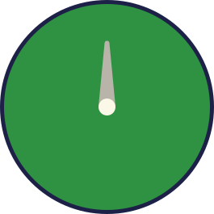
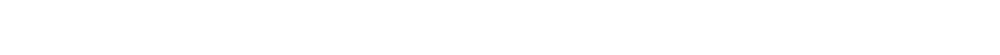

# Week 1 CSS To The Rescue:
Ik ben gegaan voor de control panel, waarbij ik in het scherm 4 controllable schermen wilde creëren. Op desktop wil ik dat er 2 naast elkaar en 2 onder elkaar komen, en op mobiel mogen ze alle 4 onder elkaar.
Ik ben meteen mijn ideeën gaan uitwerken in Figma voordat ik ging coderen. Het was voor mij de eerste keer met Figma, dus het was ook een beetje uitzoeken hoe alles precies werkte.

## Eerste scherm

<br>
Voor het eerste scherm (links boven) wilde ik een grid maken van knoppen waar de gebruiker op kan klikken. Als de gebruiker dit heeft gedaan, zal er op basis van welke knop er is aangeklikt een animatie gaan lopen op andere knoppen. Deze animatie zal oneindig duren totdat de gebruiker de knop weer indrukt om hem uit te zetten.

## Tweede scherm

<br>
Voor het tweede scherm wilde ik een soort tv maken met feitjes over bepaalde planeten. De gebruiker kan zelf aangeven welke planeet hij of zij wil zien door op een van de knoppen aan de rechterkant te drukken. Het marsmannetje zal in het scherm blijven, alleen zal er een andere planeet verschijnen en zal de tekst ook veranderen met feitjes over de andere planeet.


## Derde scherm

<br>
Voor het derde scherm (links onder) wilde ik een kleiner schermpje maken waar tekst (in dit geval lines) naar beneden scrollt. De snelheid van deze scrollende tekst kan worden bepaald door de slider die rechtsonder staat. Ook wilde ik een radar maken die kan zien waar de muis zich op dit moment bevindt, maar ik denk dat dat lastig gaat worden met alleen CSS. Mocht dit niet mogelijk zijn, dan wil ik de radar laten draaien als de muis erboven zweeft.


## Vierde scherm

<br>
Voor het vierde scherm (rechts onder) wilde ik een soort hartslagmeter maken die aan en uit gezet kan worden met de knop aan de rechterkant. Echter, ik zit nog een beetje te twijfelen, want ik overweeg ook om de knop te laten fungeren als een schakelaar tussen de lichte en donkere modus.

# Week 2 CSS To The Rescue:

## Alle schermen goed positioneren
Ik ben begonnen met het maken van 4 sections in HTML. Elk van deze sections wordt later een scherm. Ik ben op mobiel begonnen, wilde daarom dat de schermen eerst onder elkaar kwamen en als het scherm groot genoeg werd, dan zouden er 2 naast elkaar en 2 onder elkaar komen.

```
/* STYLING BODY */
body{
    background-color: var(--light-color-background);
    display: grid;
    grid-template: 1fr 1fr 1fr 1fr / 1fr;
    padding: 1rem;
    grid-gap: 1rem;
    font-family:'Keania One', sans-serif;
}

/* STYLING BODY MOBIEL */
@media screen and (min-width: 1500px){
    body{
        grid-template: 1fr 1fr / 1fr 1fr;

 }
}
```

## Eerste scherm
Ik ben voor het eerste scherm (links boven) gaan werken met een formulier waar allemaal checkboxes in zitten dat ziet er als volgt uit in HTML. Er zijn een aantal checkboxes disabled omdat ik alleen wil dat de onderste rij klikbaar is.
```
<!-- SECTION LINKS BOVEN -->
    <section>
        <form>
            <input type="checkbox" disabled>
            <input type="checkbox" disabled>
            <input type="checkbox" disabled>
            <input type="checkbox" disabled>
            <input type="checkbox" disabled>
            <input type="checkbox" disabled>
            <input type="checkbox" disabled>
            <input type="checkbox" disabled>
            <input type="checkbox" disabled>
            <input type="checkbox" disabled>
            <input type="checkbox" disabled>
            <input type="checkbox" disabled>
            <input type="checkbox" disabled>
            <input type="checkbox" disabled>
            <input type="checkbox" disabled>
            <input type="checkbox" disabled>
            <input type="checkbox" disabled>
            <input type="checkbox" disabled>
            <input type="checkbox" disabled>
            <input type="checkbox" disabled>
            <input type="checkbox" disabled>
            <input type="checkbox" disabled>
            <input type="checkbox" disabled>
            <input type="checkbox" disabled>
            <input type="checkbox" disabled>
            <input type="checkbox" disabled>
            <input type="checkbox" disabled>
            <input type="checkbox" disabled>
            <input type="checkbox" disabled>
            <input type="checkbox" disabled>
            <input type="checkbox">
            <input type="checkbox">
            <input type="checkbox">
            <input type="checkbox">
            <input type="checkbox">
        </form>
    </section>
```

Dit moest natuurlijk gestyled worden en dat heb ik als volgt gedaan

```
/* DIT IS DE STIJLING VOOR DE EERSTE SECTIE VAN DE PAGINA */
section:first-of-type{
    border-radius: 1rem;
    background-color: var(--dark-color-background);
    padding: 1.5rem;
}

/* STIJLING VOOR HET EERSTE FORMULIER BINNEN DE EERSTE SECTIE */
section:first-of-type form:first-of-type{
    display: grid;
    grid-template-columns: 1fr 1fr 1fr 1fr 1fr;
    grid-template-rows: 1fr 1fr 1fr 1fr 1fr;
    gap: 1rem;
    background-color: var(--border-color-purple);
    border-radius: 1rem;
    padding: 1.5rem;
}

/* AANPASSINGEN VOOR DE CHECKBOX-STIJL BINNEN DE EERSTE SECTIE */
section:first-of-type input[type="checkbox"]{
    appearance: none;
    background-color: var(--light-color-background);
    border: 10px solid rgba(0, 0, 0, 0.3);
    height: 3.5rem;
    width: 100%;
}

/* ANIMATIE VOOR KNOPEKLEUR VERANDERING BIJ GESELECTEERDE CHECKBOX */
form:first-of-type:has( input[type="checkbox"]:nth-of-type(5n + 1):checked ) input:nth-of-type(9n + 7){
    animation: changeButtonColor 2s infinite;
}

form:first-of-type:has( input[type="checkbox"]:nth-of-type(5n + 2):checked ) input:nth-of-type(8n + 13){
    animation: changeButtonColor 2s infinite;
}

form:first-of-type:has( input[type="checkbox"]:nth-of-type(5n + 3):checked ) input:nth-of-type(8n + 7){
    animation: changeButtonColor 2s infinite;
}

form:first-of-type:has( input[type="checkbox"]:nth-of-type(5n + 4):checked ) input:nth-of-type(8n + 11){
    animation: changeButtonColor 2s infinite;
}

form:first-of-type:has( input[type="checkbox"]:nth-of-type(5n + 5):checked ) input:nth-of-type(8n + 6){
    animation: changeButtonColor 2s infinite;
}

/* AANPASSINGEN VOOR GESELECTEERDE CHECKBOX-STIJL BINNEN DE EERSTE SECTIE */
section:first-of-type input[type="checkbox"]:checked  {
    background-color: var(--checked-button-color-active) !important;
}

```

Ik heb ook een animatie gemaakt die word toegepast en die loopt door een aantal kleuren heen van de knoppen.

```
/* CHECKBOX ANIMATION VOOR SECTION LINKS BOVEN */

@keyframes changeButtonColor {
    0% {background-color: var(--checked-button-color-1);}
    50% {background-color: var(--checked-button-color-2);}
    75% {background-color: var(--checked-button-color-3);}
    100% {background-color: var(--checked-button-color-1);}
}
```

# Week 3 CSS To the Rescue:
## Tweede scherm


Om ervoor te zorgen dat het tweede scherm op de manier waarop ik het wil wordt getoond, heb ik het als volgt ingedeeld in HTML. Dit zorgt ervoor dat ik links een groepje heb met de informatie over de planeet, de planeet zelf en de naam van de planeet. Deze zijn nu nog allemaal leeg maar worden later toegevoegd met CSS.
```
<section>
        <div> <!-- GROEP VOOR PLANEET CONTENT EN KNOPPEN-->
            <section> <!-- CONTENT MET PLANETEN-->
                <div>
                     <!-- HIER KOMT DE IMG VAN DE PLANEET-->
                    <span></span> <!--HIER KOMT DE NAAM VAN DE PLANEET-->
                </div> <!-- DIV VOOR PLANEET EN NAAM VAN PLANEET -->
                <div>
                    <p></p>
                    <p></p>
                    <p></p>
                    <p></p>
                </div> <!-- DIV VOOR INFORMATIE OVER DE PLANEET -->
                 <!-- IMG VAN MARS MANNETJE -->
            </section>
            <section> <!-- KNOPPEN VOOR DE PLANETEN-->
                <form>
                    <input type="radio" name="planet" value="earth">
                    <input type="radio" name="planet" value="mars">
                    <input type="radio" name="planet" value="saturn">
                    <input type="radio" name="planet" value="sun">
                    <input type="radio" name="planet" value="moon">
                </form>
            </section>
        </div>
    </section>
```
Met behulp van CSS heb ik ervoor gezorgd dat alle knoppen de juiste planeet laten zien en dat de relevante informatie over de planeet wordt ingeladen wanneer er op die knop wordt gedrukt. Dit ziet er als volgt uit:

Ik heb eerst aangegeven dat de stijl moet worden toegepast op de tweede sectie waar geen formulier rechtstreeks binnen die sectie aanwezig is. Dit betekent dat de CSS specifiek gericht is op de situatie waarin er meerdere secties zijn en ik specifiek de tweede sectie wil targeten, maar alleen als er binnen die sectie geen formulier aanwezig is. Deze sectie is bedoeld voor het weergeven van informatie over de planeet, zoals de naam, de planeet zelf en enkele feiten. Vervolgens heb ik de stijl toegepast op het linker scherm, waarop de planeet, de naam van de planeet en de feiten worden weergegeven. Hierbij heb ik een border image en een background image toegevoegd voor visuele verbeteringen.
```
section:nth-of-type(2):not(:has(> form)){
    border-radius: 1rem;
    height: auto;
    border: 30px solid var(--border-color-purple);
    background-color: var(--dark-color-background);
}

section:nth-of-type(2) div:first-of-type{
    display: flex;
    justify-content: space-around;
    align-items: center;
    padding: 0.5rem;
    height: 100%;
    border-radius: 0.5rem;
}

section:nth-of-type(2) div:first-of-type{
    container-type: inline-size;
}

section:nth-of-type(2) div:first-of-type section:first-of-type{
    background-image: url('./assets/img/spaceBackground.jpg');
    background-repeat: no-repeat;
    background-position: center;
    position: relative;
    border-image-source: url("./assets/img/borderBackgroundDark.svg");
    border-image-slice: 25;
    border-style: solid;
    border-width: 25px;
    min-width: 75%;
    min-height: 80%;
    container-type: inline-size;
}
```

Nu moet de content van de planeten en de content die in de knoppen komt nog correct worden weergegeven. Dat doe ik met de volgende CSS. Ik wil, als er nog tijd voor is, kijken of deze CSS wat netter en minder complex geschreven kan worden. Voor elke planeet heb ik een aparte animatie gemaakt, en die roep ik per planeet op. De code is voor elke planeet hetzelfde, maar dan met de juiste planeet; in dit geval dus de aarde
```

@keyframes planetFadeInEarth {
    0% {
        transform: scale(0.8);
        opacity: 0;
    }
    100% {
        transform: scale(1);
        opacity: 1;
    }
}

@keyframes textUnmaskEarth{
    0% {
        clip-path: inset(0 100% 0 0);
    }
    100% {
        clip-path: inset(0 0 0 0);
    }
}

/* EARTH  */
section:nth-of-type(2) div:first-of-type:has(form:first-of-type input[type="radio"]:first-of-type:checked) section:first-of-type div:first-of-type img{
    animation: planetFadeInEarth 0.3s ease-in-out;
    content: url(./assets/img/earth.svg);
}
section:nth-of-type(2) div:first-of-type:has(form:first-of-type input[type="radio"]:first-of-type:checked) section:first-of-type span:first-of-type:after{
    content:  'Earth';
    color: var(--text-color);
    animation: textUnmaskEarth 0.3s linear;
}


```
Hier worden de feitjes per planeet ingeladen met een animatie.
```
@keyframes factsUnmaskEarth{
    0% {
        clip-path: inset(0 0 0 100%);
    }
    100% {
        clip-path: inset(0 0 0 0);
    }
}


/* EARTH */
/* ANIMATION */
section:nth-of-type(2) div:first-of-type:has(form:first-of-type input[type="radio"]:first-of-type:checked) section:first-of-type p{
    animation: factsUnmaskEarth 0.3s linear;
}

section:nth-of-type(2) div:first-of-type:has(form:first-of-type input[type="radio"]:first-of-type:checked) section:first-of-type p:first-of-type:after{
    content: "Earth's surface area is about 510 million square kilometers.";
}
section:nth-of-type(2) div:first-of-type:has(form:first-of-type input[type="radio"]:first-of-type:checked) section:first-of-type p:nth-of-type(2):after{
    content: "Average surface temperature: 15°C (59°F).";
}
section:nth-of-type(2) div:first-of-type:has(form:first-of-type input[type="radio"]:first-of-type:checked) section:first-of-type p:nth-of-type(3):after{
    content: "Day length: Approximately 24 hours.";
}
```

## Week 4

## Derde scherm

<br>
Het rechter scherm bevat een kleiner scherm met daarin scrollende lijnen, rechts heb ik een radar gemaakt die ronddraait als je er met je muis over hovert en daaronder heb ik een slider gemaakt die de scroll snelheid bepaald van het linker schermpje. dat zier er als volgt uit in html

```
 <section>
        <section> <!-- EERSTE SCHERM (SCROLL) -->
            <span></span>
            <span></span>
            <span></span>
            <span></span>
            <span></span>
            <span></span>
            <span></span>
            <span></span>
            <span></span>
            <span></span>
            <span></span>
            <span></span>
            <span></span>
            <span></span>
            <span></span>
            <span></span>
            <span></span>
            <span></span>
            <span></span>
            <span></span>
            <span></span>
            <span></span>
            <span></span>
            <span></span>
            <span></span>
            <span></span>
            <span></span>
            <span></span>
            <span></span>
            <span></span>
            <span></span>
            <span></span>
            <span></span>
            <span></span>
            <span></span>
            <span></span>
            <span></span>
            <span></span>
            <span></span>
            <span></span>
            <span></span>
            <span></span>
            <span></span>
            <span></span>
            <span></span>
            <span></span>
        </section>
        <div> <!-- GROEP VOOR RECHTER SCHERMEN (RADAR EN SLIDER) -->
            <section> <!--SECTION VOOR DE RADAR-->
                
            </section>
            <section> <!--SECTION VOOR DE SLIDER-->
                <input type="range" min="1" max="10" step="1" value=".9" name="scrollSpeec" orient="horizontal">	
            </section>
        </div>
    </section>  
```
Ik heb eerst de layout van het rechter scherm gestyled voor desktop en mobiel

```
section:nth-of-type(3){
    align-items: center;
    justify-content: center;
    border-radius: 1rem;
    background-color: var(--dark-color-background);
    padding: 1.5rem;
    border: 30px solid var(--border-color-purple);
    display: grid;
    gap: 1rem;
}

/* STYLING VOOR DE RECHTER KANT (RADAR EN SLIDER) DESKTOP */
@media screen and (min-width: 40em){
    body > section:nth-of-type(3){
        grid-template-columns: 1fr 1fr;
    }
}
```
Daarna ben ik de scrollable content gaan stylen en het zijn eigelijk een hoop span onderdelen die precies goed getimed op nieuw beginnen te animeren waardoor het lijkt alsof er oneindig word gescrolled. Ik geef ook aan dat elke 2e span 30% breed moet zijn elke 3e 60% en elke 4e 80% om zo niet voor elke span een nieuwe CSS regel te hoeven schrijven.

```

@keyframes infiniteScrollVertical {
    0% {
        transform: translateY(0%);
    }
    99.9% {
        transform: translateY(-2400%);
    }
    100%{
        transform: translateY(0%);
    }
}

section:nth-of-type(3) > section:first-of-type{
    border-image-source: url("./assets/img/borderBackgroundLight.svg");
    border-image-slice: 25;
    border-style: solid;
    border-width: 25px;
    background-color: var(--border-color-purple);
    overflow: hidden;
    display: grid;
    align-content: center;
    height: 100%;
}

section:nth-of-type(3) > section:first-of-type > span{
    animation: infiniteScrollVertical var(--animation-duration) linear infinite;   
    border-radius: 1rem;
    background-color: var(--dark-color-background);
    border: 1px solid black;
    width: 40%; 
    height: 1rem;
    margin:0.5rem;
}

section:nth-of-type(3) > section:first-of-type span:nth-of-type(2n){
    width: 30%;
}

section:nth-of-type(3) > section:first-of-type span:nth-of-type(3n){
    width:60%;
}

section:nth-of-type(3) > section:first-of-type span:nth-of-type(4n){
    width:80%;
}

```

Daarna ben ik het scherm van de radar gaan stylen en ook begonnen met geneste CSS te gebruiken. Dit maakt het een stuk overzichtelijker en zorgt er voor dat ik niet meer van die hele lange specifieke CSS regels hoef te schrijven. Ik maak gebruik van de ```animation-play-state``` om er zo voor te zorgen dat de radar niet elke keer opnieuw gaat beginnen als de muis er van af gehaald word maar dat hij gewoon pauzeerd

```
@keyframes radarRotate {
    0% {
        transform: rotate(0deg);
    }
    100% {
        transform: rotate(360deg);
    }
}

section:nth-of-type(3) > div > section:first-of-type{    
    display: flex;
    align-items: center;
    justify-content: center;
    border-image-source: url("./assets/img/borderBackgroundLight.svg");
    border-image-slice: 25;
    border-style: solid;
    border-width: 25px;
    height: 90%;
    background-color: var(--dark-color-background);

    img{
        animation: radarRotate 1s linear infinite;
        animation-play-state: paused;
    }
}

section:nth-of-type(3) > div > section:hover{
    img{
        animation-play-state: running;
    }
}
```

De slider vond ik misschien wel het leukst om te maken. Ik heb een simpele slider gemaakt in HTML en ik zorg er vervolgens met JavaScript voor dat de waarde die de slider heeft de hoeveelheid seconde word dat de animatie gaat lopen. Dit heb ik gedaan met een custom property en het ziet er als volgt uit
```
:root{
    --animation-duration: 1s;
}
```
```
const slider = document.querySelector('[type="range"]');

slider.oninput = function() {
    document.documentElement.style.setProperty('--animation-duration', `${slider.value}s`);
};

```
Ik heb wel gemerkt dat ondanks dart ik hier ```-webkit-slider-thumb``` zeg de style van de slider niet werkt in Safari

```
/* STYLING VOOR DE SLIDER */
section:nth-of-type(3) > div > section:nth-of-type(2){
    border-image-source: url("./assets/img/borderBackgroundLight.svg");
    border-image-slice: 25;
    border-style: solid;
    border-width: 25px;
    display: flex;
    flex-direction: column;
    align-items: center;
    margin: 1rem 0 0 0;

    input[type=range]{
        appearance: none;
        width: 100%;
        height: 100%;
        border: 0.4rem solid var(--border-color-purple);
        background: transparent;
        border-radius: 1rem;
    }
    /* SLIDER BOLLETJE VOOR WEBKIT */
    input[type=range]::-webkit-slider-thumb {
        -webkit-appearance: none;
        appearance: none;
        border: none;
        border-radius: 0;
        height: 100%; 
        width: 15%;
        background: var(--clickable-button-color);
        -webkit-border-radius: 0.5rem;
    }
    /* SLIDER BOLLETJE VOOR FIREFOX */
    input[type=range]::-moz-range-thumb {
        appearance: none;
        border: none;
        border-radius: 0;
        height: 100%; 
        width: 15%;
        background: var(--clickable-button-color);
        border-radius: 0.5rem;
    }
}
```

### Scherm rechts onder


```

    <section>
        <section> <!--SCHERM MET PULSE-->
            <div>
                
            </div>
        </section>
        <div> <!--GROEP VOOR DE KNOPPEN-->
            <form>
                <input type="radio" name="controlZigzag" checked>
                <input type="radio" name="controlZigzag">
            </form>
        </div>
```

Ik heb hier een svg in geplaats (zigzag) met daar onder een form waarin bepaald word in welke state de zigzag zich bevind. Helemaal ingeklapt of helemaal uitgeklapt.

Dit ziet er als volg uit in CSS

Ik geef de div die om de svg heen zit een animatie die er voor zorgt dat hij de ilusie krijgt dat hij oneindig naar rechts scrollt en daarna gebruik ik has om te kijken wanneer de svg zelf moet worden ingeklapt. Ik heb hiervoor 2 animaties gemaakt (collapse en unCollapse)
```

@keyframes collapse {
    0% {
        transform: scaleY(1);
    }
    100% {
        transform: scaleY(0);
    }
}

@keyframes unCollapse {
    0% {
        transform: scaleY(0);
    }
    100% {
        transform: scaleY(1);
    }
}

section:nth-of-type(4) section:first-of-type{
    div{
        animation: infiniteScrollHorizontal 5s linear infinite;
    }
    display: flex;
    align-items: center;
    justify-content: center;
    border-image-source: url("./assets/img/borderBackgroundLight.svg");
    border-image-slice: 25;
    border-style: solid;
    border-width: 25px;
    overflow: hidden;
    background-color: var(--border-color-purple);
}


section:nth-of-type(4):has(input:first-of-type:checked) section:first-of-type img {
    animation: unCollapse 1s linear forwards;
}

section:nth-of-type(4):has(input:nth-of-type(2):checked) section:first-of-type img {
    animation: collapse 1s linear forwards;
}
```


